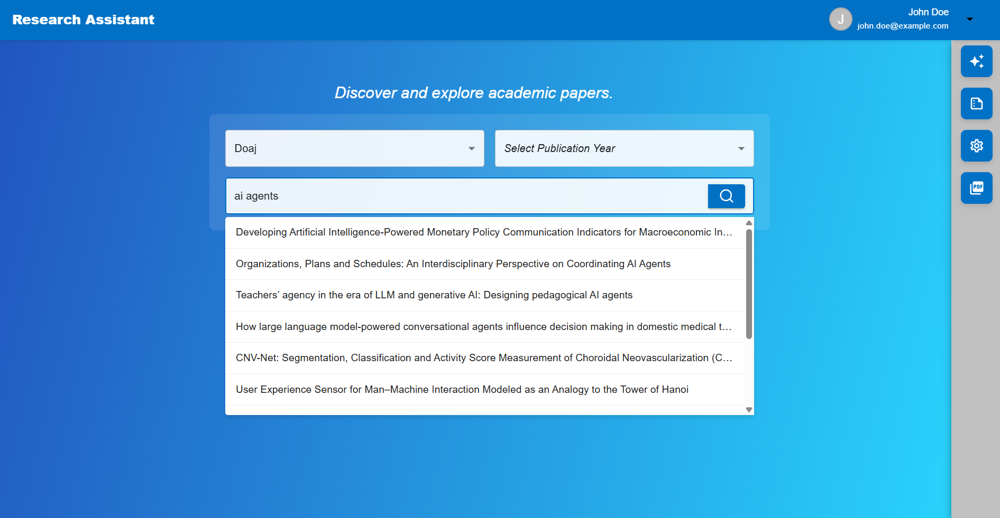
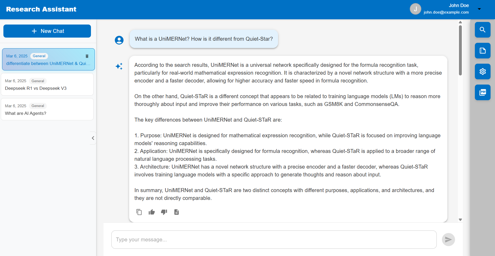
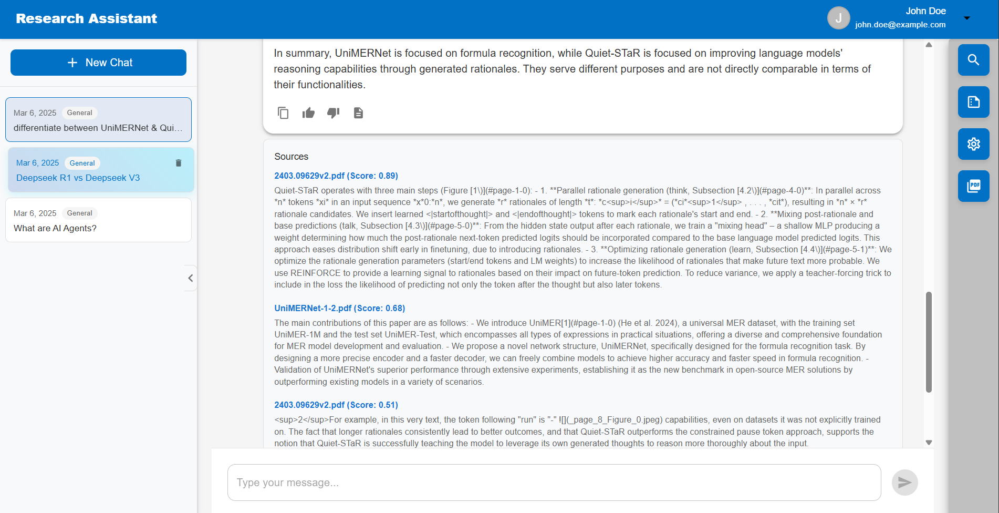
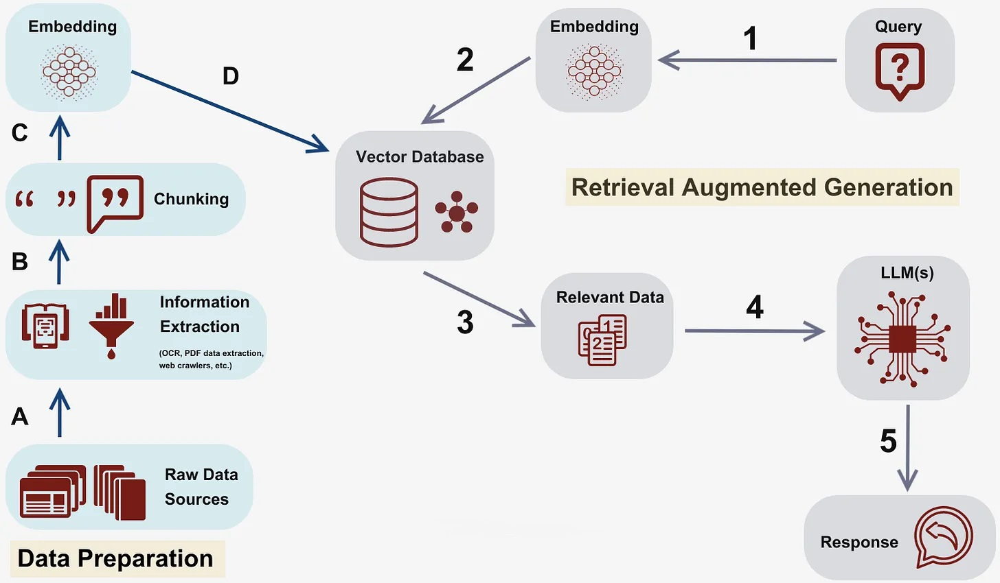

# RAG Chatbot for Researchers

This repository `https://github.com/navchetna/ai-agents` provides a comprehensive framework for building a Retrieval-Augmented Generation (RAG) chatbot specifically designed for researchers. This framework combines various components to create a powerful system that can retrieve relevant information from documents and generate accurate, contextually appropriate responses.

|   |   |
| ----------------------------------- | ----------------------------------- |
|  |  |
|  |  |

## Device Requirements

Before getting started, ensure your system meets the following requirements:

### System Resources:
- **RAM**: At least 10GB of free RAM -> Groq setup
- **Storage**: Required storage space depends on your configuration:
  - **Base setup (using Groq)**: ~7.7GB
    - 2.8GB for Docker images
    - 1.1GB for `BAAI/bge-reranker-base` model
    - 256MB for `BAAI/bge-small-en-v1.5` model
    - 3.4GB for dataprep models
- **Additional for vLLM setup**: 5-10GB extra for `meta-llama/Llama-3.2-1B-Instruct` model

### Recommended Configuration:
- **For Server Deployments**: vLLM option
- **For Personal Computers**: Use Groq serving option

## vLLM vs Groq for model serving:

The repository offers two options for the LLM serving component: Groq and vLLM.
- **vLLM** is an open-source high-performance inference engine for large language models.
- **Groq** is a proprietary inference engine designed for ultra-fast response times using specialized hardware.

Groq is recommended for running the application on personal computers as Groq's API-based approach does **NOT** require running the LLM locally, making it much less resource-intensive for personal computers that may not have powerful GPUs. Additionally using Groq requires only an **API key** rather than setting up a complex local inference environment.

The vLLM option is more suitable for server deployments with dedicated GPU resources where running models locally might be preferred for reasons like data privacy.

---

## How is RAG Implemented?

RAG combines retrieval systems with large language models to generate more accurate and relevant responses by incorporating external knowledge.



### Key Components:
- **Dataprep Component**: The framework includes a dataprep component that processes input documents, breaking them into manageable chunks that can be embedded and indexed.
- **Embedding Service**: Documents are transformed into vector representations using embedding models like `BAAI/bge-base-en-v1.5` which captures the semantic meaning of text.
- **Vector Storage**: These embeddings are stored in a `Redis` vector database, allowing for efficient similarity searches.
- **Retriever Component**: When a user asks a question, the retriever component finds the most relevant document chunks by comparing the query embedding with the stored document embeddings.
- **Reranker Component**: Retrieved documents are further refined through a reranking process using models like `BAAI/bge-reranker-base` to ensure the most relevant context is provided to the LLM.
- **LLM Backend**: The LLM (either via `vLLM` or `Groq`) generates responses based on the retrieved context and the user's query.
- **Audio Component**: Transcribes audio input into text, enabling voice interaction with the RAG system. Uses OpenAI's `Whisper base` model.
- **Frontend UI**: User interface to interact with the chatbot.

This architecture allows real-time information integration and better response quality by combining search capabilities with generative models.

Each service is **containerized** for modularity and scalability.

---

## Prerequisites: Setting Up Docker

Before building the application images, you need to have Docker installed on your system.

### Installing Docker

1. Visit the official Docker installation guide here -> [Install docker](https://docs.docker.com/engine/install/)

2. **Choose your operating system:**
   - Windows users with WSL: Select **Ubuntu** from the installation options
   - Mac users: Select **Docker Desktop for Mac**
   - Linux users: Select your specific distribution (Ubuntu, Debian, Fedora, etc.)

3. Follow the installation steps provided in the documentation for your chosen platform

4. After completing the installation, restart your terminal or command prompt

### Verifying Docker Installation

To verify that Docker is installed correctly, open your terminal and run:

```bash
docker
```

**Expected Output:**
You should see Docker's help information displayed, similar to this:

```
Usage:  docker [OPTIONS] COMMAND

A self-sufficient runtime for containers

Common Commands:
  run         Create and run a new container from an image
  exec        Execute a command in a running container
  ps          List containers
  build       Build an image from a Dockerfile
  pull        Download an image from a registry
  push        Upload an image to a registry
  images      List images
  login       Log in to a registry
  logout      Log out from a registry
  search      Search Docker Hub for images
  version     Show the Docker version information
  info        Display system-wide information
...
```

If you see this output (or similar), Docker is successfully installed! If you get an error like "command not found" or "docker is not recognized", please revisit the installation steps.

Once Docker is successfully installed and verified, you're ready to proceed with building the application images.

---

## Instructions for application setup:

### Build images for all services

Only run the ***BUILD*** commands present in each of these README files.
Run them individually ONLY for testing.

1. [Build dataprep component](./comps/dataprep/README.md)
2. [Build retriever component](./comps/retriever/README.md)
3. [Build backend component](./comps/README.md)
4. [Build Groq component](./comps/groq/README.md)
5. [Build UI component](./design-patterns/rag/README.md)

Optional components:

6. [Build vLLM image](./comps/README.vllm.md)
7. [Build Whisper component](./comps/whisper/README.md)

---

## Configure Environment Variables

Before running the application, you need to configure your API keys and cache directories:

1. Copy the example environment script:
   ```bash
   cd ai-agents/
   cp env-example.sh .env.sh
   ```

2. Edit `ai-agents/.env.sh` and add your API keys and configure cache directories:
   - Add your `GROQ_API_KEY` or `HUGGINGFACEHUB_API_TOKEN`
   - Set appropriate cache directories for models and data
   - Configure any other required environment variables

3. Make the script executable:
   ```bash
   chmod +x .env.sh
   ```

4. Source the environment variables:
   ```bash
   source .env.sh
   ```

---

## Run the Application

### Running with Groq Serving (Recommended for PC)

Once you have built all the required images and configured your environment variables, you can start the application using Docker Compose. This will spin up Groq as the serving engine.

**Run in foreground:**
```bash
cd ai-agents/ # make sure you're in the right directory
docker compose -f install/docker/research-assistant/docker-compose-groq.yaml up
```

**Run in background (detached mode):**
```bash
cd ai-agents/
docker compose -f install/docker/research-assistant/docker-compose-groq.yaml up -d
```

To view logs when running in background:
```bash
cd ai-agents/
docker compose -f install/docker/research-assistant/docker-compose-groq.yaml logs -f
```

To stop the application running in background:
```bash
docker compose -f ai-agents/install/docker/research-assistant/docker-compose-groq.yaml down
```

### Accessing the Application

Once all services are running, open your browser and navigate to:
```
http://localhost:5009
```

You should now be able to interact with the RAG chatbot

---

## Upload Your Own PDFs

To upload your own PDF documents to the RAG system, use the following curl command:

```bash
curl -X POST "http://localhost:1006/v1/dataprep" \
  -H "Content-Type: multipart/form-data" \
  -F "files=@/path/to/your/document.pdf"
```

**Note:** The first time you upload a PDF, it may take some time as the system downloads multiple embedding and processing models. Subsequent file uploads will be much faster.

---

## Run serving engines individually (Optional)

### Groq Serving (Recommended for PC):
```bash
export LLM_SERVER_HOST_IP=groq-service
export LLM_SERVER_PORT=8000
export GROQ_MODEL=llama-3.3-70b-versatile
export GROQ_API_KEY=${GROQ_API_KEY}

docker compose -f install/docker/docker-compose-groq.yaml up
```

### vLLM Serving (Not required for PC development):
```bash
export SERVER_HOST_IP=vllm-service
export LLM_SERVER_HOST_IP=vllm-service
export LLM_SERVER_PORT=8000

docker compose -f install/docker/research-assistant/docker-compose.yaml up
```

---

## References

- [OPEA components repository](https://github.com/opea-project/GenAIComps)
- [OPEA examples repository](https://github.com/opea-project/GenAIExamples)
- [vLLM](https://github.com/vllm-project/vllm)
